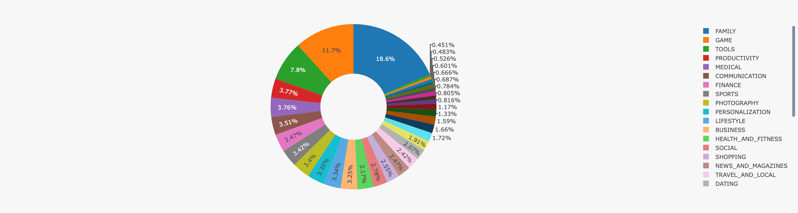
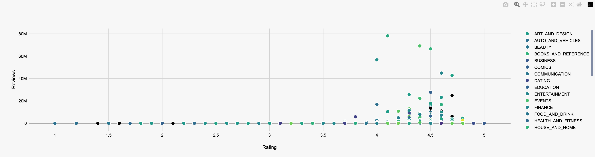
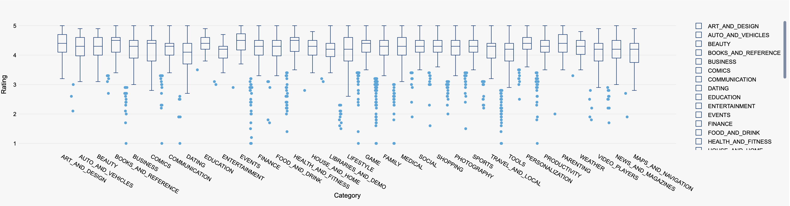
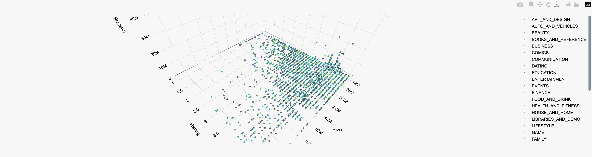

# Human-Computer-Interaction

## lab3-data-visualization

| name      | Student Id |
| --------- | ---------- |
| Liu Chang | 2054164    |

### Introduction

#### Selected Dataset

I selected the **google-play-store-apps** dataset, which shows the **Rating**, **Reviews**, **Size**, **Installs** and other information of different apps.

#### Dependencies Installation

1. Create a virtual environment with conda

   ```sh
   conda create -n hci python=3.8
   ```

2. Install the dependencies

   ```sh
   conda install pandas
   pip install dash
   ```

3. Run the main.py file

   ```sh
   python main.py
   ```

### Data Process


1. The **Category** error was found to be the problem of data encoding after positioning, which resulted in the comma separator not being displayed, so it was manually modified.

   ```python
   Safe Ag Systems�?BUSINESS,4.7,...,4.0.3 and up,
   Safe Ag Systems, BUSINESS,4.7,...,4.0.3 and up
   ```

2. The Rating column has NaN values and values other than 0-5. Use pandas to clean it up.

   ```python
   df = df.dropna(subset=['Rating']) # 删去NaN
   df = df[pd.to_numeric(df['Rating'], errors='coerce').between(0, 5)] # 删去非0-5
   ```

### Data Visualization

#### Pie Chart (App Categories Proportion)

We use the **Category** column as a fan-shaped area to show the proportion of each app category in the dataset.



We observe a clear difference in the number of apps in different categories. The top three categories are family, game and tools, which indicates that family-related apps are popular in contemporary society, game-related games are more popular among young people, and tools apps are also a necessity in People's Daily life.

#### Scatter Chart (App Ratings and Reviews)

We use the **Rating** column as the X-axis and the **Reviews** column as the Y-axis to show the distribution of apps based on the number of ratings and reviews the app has received.



Based on the provided table, a clear correlation can be observed between the app rating and the number of reviews. It is evident that higher ratings are associated with a greater number of reviews. Notably, apps with ratings ranging from 3.7 to 4.8 exhibit the highest number of reviews. The statistical findings identify Facebook, WhatsApp Messenger, and Instagram as the top three apps with the highest review counts. Additionally, it is apparent that social and communication apps significantly outperform others in terms of the number of comments. This suggests that, in today's digital age, the majority of social interactions occur through network-enabled devices.

#### Box Plot (Distribution of app ratings across categories)

The **Category** column is used as the X-axis and the **Rating** column is used as the Y-axis to show the distribution of app ratings in each category, grouped by **App** category.



Through the analysis of box plots, we find that most apps have a rating above 4, many apps have a maximum rating of 5, and values below 3 are identified as outliers because there are very few of them compared to those above 4. It can be seen that apps listed on Google are of good quality.

#### Scatter 3D Chart (analysis of app size, app score, number of reviews)

We use **Size**, **Rating**, and **Reviews** for different apps, with each data point representing one app. Through this 3D scatter plot, we can intuitively understand the relationship between the size, rating, and number of reviews of different apps, helping us to observe the distribution pattern of the data and the trends that may exist.



From this figure, we can find that the rating level is often positively correlated with the number of reviews, because only when an app has high quality will more users be attracted to use it, and they will review it after using it for a period of time. At the same time, these apps with high ratings and a large number of reviews tend to have larger app size, we can simply think that more complex apps can have higher quality.

